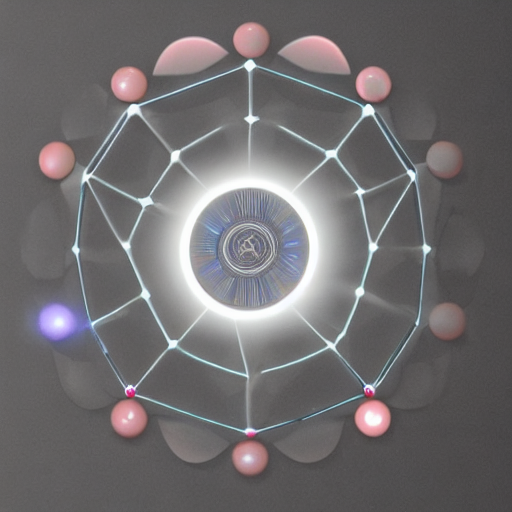

# VisionForge-AI

VisionForge-AI is a diffusion-based AI image generation studio with self-refining generation, automatic output scoring, reference-image matching, portrait evaluation, benchmark tools, session exploration, and experiment reporting.

The project started as a portfolio-oriented image generation app and evolved into a broader image-generation system that can generate, evaluate, compare, refine, and document visual outputs.



## Overview

VisionForge-AI is designed as a local AI image-generation workflow for software project visuals, creative image experiments, portrait reference matching, and iterative output improvement.

Instead of only generating one image from one prompt, the system can:

* Generate multiple candidates
* Evaluate each output automatically
* Select the best result
* Use the best result as the next input
* Mutate prompts to explore different visual directions
* Keep a reference image as an anchor
* Score portrait and face-like outputs
* Compare model presets
* Export experiment reports
* Explore self-refinement sessions visually

## Key Features

### Text-to-Image Generation

Generate images from structured prompts using diffusion models.

Features:

* Project-specific prompt presets
* Style presets
* Output-type presets
* Negative prompt builder
* Seed-based reproducibility
* Batch variations
* Metadata saving

### Image-to-Image Generation

Upload a reference image and guide the model with a prompt.

Features:

* Strength control
* Reference-image transformation
* Metadata tracking
* Local output storage

### Self-Refining Generation

The self-refining generation loop is one of the main advanced features of this project.

Workflow:

1. Generate multiple candidate images
2. Score each candidate
3. Select the best output
4. Use the selected output as the next image-to-image input
5. Repeat the process for multiple iterations

The system stores each iteration, candidate, score, prompt variant, parent source, and selected output.

### Prompt Mutation Engine

To avoid getting stuck in one visual pattern, VisionForge-AI can generate prompt variants automatically.

Example prompt mutation directions:

* Network-control
* Molecular-glucose
* Minimal-control
* Data-field
* Holographic-grid
* Portrait-clean
* Portrait-studio
* Reference-structure
* Reference-colors
* Reference-detail

This makes the generation loop more exploratory and helps the system search for better visual directions.

### CLIP-Assisted Evaluation

VisionForge-AI supports optional CLIP-based scoring for:

* Prompt-image alignment
* Reference-image similarity
* Semantic matching

This helps the system rank outputs using both visual heuristics and semantic similarity.

### Reference Match V2

Reference Match V2 improves reference-based generation by keeping the original image as an anchor during refinement.

The system can generate candidates from:

* The best previous output
* The original reference image
* A fresh prompt-based exploration path

This helps the loop stay closer to the target image instead of drifting too far away.

### Portrait Reference Studio

A dedicated workflow for portrait and face-like reference matching.

Features:

* Upload portrait reference image
* Generate multiple candidates
* Keep reference anchor in every iteration
* Use portrait-specific prompt mutation
* Score face quality
* Score face-reference similarity
* Track the best output over iterations

### Face / Portrait Evaluator

A dedicated evaluator page for portrait outputs.

It estimates:

* Face count
* Face quality
* Face-reference similarity
* Visual quality
* Final ranking score

The evaluator uses OpenCV-based face detection and heuristic visual scoring.

Note: this tool estimates visual similarity and face quality. It does not identify people.

### Benchmark Studio

Benchmark Studio compares different model presets or settings on the same prompt.

It can:

* Run the same prompt on multiple model presets
* Generate several candidates per model
* Score all outputs
* Show the best output per model
* Compare model performance in a table

### Experiment Report Exporter

VisionForge-AI can export experiment reports from generated outputs and metadata.

Supported exports:

* Markdown report
* JSON report

The report includes:

* Best output
* Top scored outputs
* Prompts
* Scores
* Reference similarity
* Face quality
* Session information
* Image paths

### Session Explorer

Session Explorer visualizes self-refinement runs.

It shows:

* Session IDs
* Iteration timeline
* Best output per iteration
* Candidate outputs
* Score changes
* Prompt labels
* Parent sources
* Raw metadata

### Project Dashboard

The Project Dashboard provides a high-level overview of the whole system.

It shows:

* Total generated outputs
* Scored outputs
* Self-refinement sessions
* Face-aware outputs
* Best current output
* Project summaries
* Prompt variant summaries
* Session summaries
* System health table

## Project Presets

VisionForge-AI currently includes presets for:

* GlucoPilot-RL
* ChessRL-Agent
* Habit Tracker
* MarketBoard
* VisionForge-AI
* Custom AI projects

## Model Presets

The app supports:

* SD 1.5 Quality
* SD Turbo Fast
* Small SD model
* Technical test model
* Custom Hugging Face model ID

The technical test model is only for verifying that the pipeline works. For real outputs, use a production-quality model such as SD 1.5 Quality or another compatible diffusion model.

## Size Presets

Available size presets include:

* GPU Quick Test
* Square Cover
* GitHub README Banner
* LinkedIn Post
* App Icon
* Website Hero
* Custom Size

## Application Pages

The Streamlit app includes:

* Project Dashboard
* Generate
* Image-to-Image
* Output Gallery
* Prompt Lab
* Experiments
* Self-Refining Generation
* Face Evaluator
* Portrait Reference Studio
* Experiment Report
* Benchmark Studio
* Session Explorer

## Tech Stack

* Python
* PyTorch
* Hugging Face Diffusers
* Transformers
* CLIP
* Streamlit
* Pillow
* NumPy
* OpenCV
* Python-dotenv

## Installation

Clone the repository:

```bash
git clone https://github.com/mohammad-azimi/VisionForge-AI.git
cd VisionForge-AI
```

Create and activate a virtual environment:

```bash
python -m venv .venv
.venv\Scripts\activate
```

Install dependencies:

```bash
python -m pip install --upgrade pip
python -m pip install -r requirements.txt
```

## GPU Setup

For NVIDIA GPU acceleration, install a CUDA-compatible PyTorch build.

Example:

```bash
python -m pip uninstall torch torchvision torchaudio -y
python -m pip install torch==2.7.1 torchvision==0.22.1 torchaudio==2.7.1 --index-url https://download.pytorch.org/whl/cu118
```

Verify CUDA:

```bash
python -c "import torch; print(torch.__version__); print(torch.version.cuda); print(torch.cuda.is_available()); print(torch.cuda.get_device_name(0) if torch.cuda.is_available() else 'No GPU')"
```

## Running the App

```bash
python -m streamlit run app.py
```

The app opens locally in the browser.

## Recommended Settings

### Fast Test

```text
Model preset: SD Turbo Fast
Size preset: GPU Quick Test
Inference steps: 4
Guidance scale: 0
```

### Quality Portfolio Output

```text
Model preset: SD 1.5 Quality
Size preset: Square Cover
Inference steps: 30-35
Guidance scale: 7.5
```

### Self-Refining Generation

```text
Refinement iterations: 3
Candidates per iteration: 4
Use CLIP semantic evaluator: enabled
Enable prompt mutation: enabled
Fresh exploration candidates per iteration: 1-2
```

### Portrait Reference Studio

```text
Evaluation profile: Reference Match
Use CLIP semantic evaluator: enabled
Portrait reference mode: enabled
Keep reference anchor every iteration: enabled
Reference-anchor candidates per iteration: 2
Fresh exploration candidates per iteration: 0
```

## Output Files

Generated images and metadata are saved locally in:

```text
outputs/
```

This folder is ignored by Git because generated outputs can become large.

Selected showcase examples can be copied into:

```text
assets/examples/
```

## Project Structure

```text
VisionForge-AI/
├── app.py
├── README.md
├── requirements.txt
├── assets/
│   └── examples/
├── pages/
│   ├── 0_Project_Dashboard.py
│   ├── 1_Self_Refining_Generation.py
│   ├── 2_Face_Evaluator.py
│   ├── 3_Portrait_Reference_Studio.py
│   ├── 4_Experiment_Report.py
│   ├── 5_Benchmark_Studio.py
│   └── 6_Session_Explorer.py
└── src/
    └── visionforge/
        ├── evaluator.py
        ├── face_evaluator.py
        ├── generator.py
        ├── history.py
        ├── presets.py
        ├── prompt_builder.py
        ├── prompt_mutator.py
        ├── prompt_tools.py
        ├── reporting.py
        └── self_refiner.py
```

## Example Workflow

A typical self-refining workflow:

1. Select a project or write a custom prompt
2. Generate several candidates
3. Automatically score the outputs
4. Select the best candidate
5. Refine the selected image through image-to-image
6. Mutate prompts to explore alternatives
7. Repeat for several iterations
8. Review the session in Session Explorer
9. Export the experiment report

## Current Status

VisionForge-AI is currently a functional MVP+ project.

It supports real diffusion models, GPU-accelerated generation, iterative self-refinement, prompt mutation, reference-aware refinement, portrait evaluation, benchmarking, session exploration, and report exporting.

## Roadmap

Planned improvements:

* Face embedding similarity using a dedicated face-recognition model
* ControlNet support for layout-guided generation
* LoRA fine-tuning for a custom visual style
* Better artifact detection
* More advanced automatic prompt rewriting
* FastAPI backend version
* Model performance tracking over time
* Exportable HTML reports
* Optional cloud deployment

## Notes

This project is intended for experimentation, portfolio visuals, and research-style image generation workflows.

For real-person portraits, use only images you own or have permission to use.

## License

This project is licensed under the MIT License. See the [LICENSE](LICENSE) file for details.